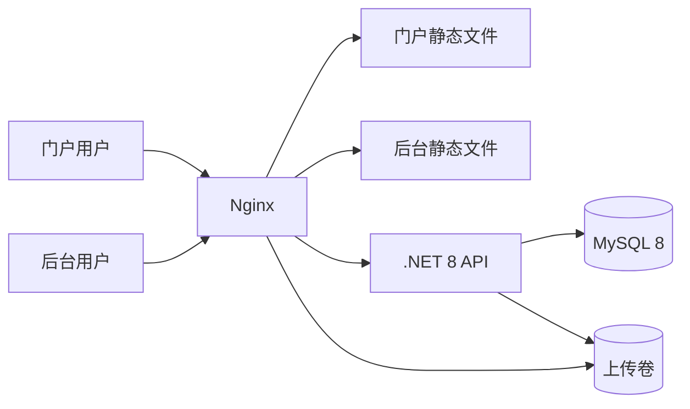

# 系统架构

项目包含两个 Vue 3 前端和一个 .NET 8 API。API 按控制器、业务服务、仓储和实体分层，业务数据存储于 MySQL 8。

## 部署关系

Docker Compose 定义 MySQL、API、Nginx 和公告初始化服务。门户默认发布到宿主端口 8082，后台到 8080，API 代理到 5001；MySQL 与 API 容器通过内部网络连接。Nginx 构建镜像时构建两个前端。

配置来源为 [docker-compose.yml](../docker-compose.yml)、[Nginx 配置](../nginx/conf.d/default.conf) 和 [部署脚本](../deploy-ubuntu22-docker.sh)。

## 前端

| 模块 | 实现 |
| --- | --- |
| 门户 | Vue 3、Vue Router、Tailwind CSS、Axios |
| 后台 | Vue 3、Vue Router、Pinia、Element Plus、Axios、WangEditor、ECharts |
| API 请求 | 相对地址 `/api`；开发由 Vite 代理，部署由 Nginx 代理 |
| 文件访问 | `/uploads/...`；API 和 Nginx 读取同一上传卷 |

门户通过 `PortalLayout` 共用页头、页脚和元信息。列表、详情及查询状态由组合函数处理，旧响应不会覆盖新查询。后台公共逻辑处理身份验证、令牌刷新、上传、表单提交、未保存提醒和错误提示。

公司标语、联系方式、地图、交通及 FAQ 由后台“门户设置”维护；导航及首页模块由门户静态配置维护。配置位置和生效方式见 [配置存储位置](configuration/storage.md)。

## API 分层

| 目录 | 职责 |
| --- | --- |
| `Controllers` | 路由、授权、请求和响应 |
| `Services` | 业务规则、内容校验、附件引用、初始化与迁移 |
| `Repositories` | 查询、投影和数据访问 |
| `Models/DTOs` | 请求校验及数据传输 |
| `Models/Entities` | 数据实体、内容版本 |
| `Data` | EF Core 上下文及数据库映射 |
| `Middleware` | 异常处理和操作日志 |

依赖及具体版本以 [API 项目文件](../BackEnd/HailongConsulting.API/HailongConsulting.API.csproj) 和两个前端锁文件为准。

## 数据与一致性

- 公告、资讯、企业资料、附件、地区、用户、日志和访问统计使用各自的业务表。
- 公司展示配置以 JSON 存储于 `portal_site_settings`，API 与门户共用一份默认 JSON。
- 公告、资讯、企业资料和门户设置使用独立 `version`；保存携带读取版本，冲突返回 409。
- 浏览量独立原子递增，不修改内容版本；管理详情不计浏览量。
- 预算与中标 / 成交金额为独立字段，单位为万元。列表只查询展示字段，正文在详情读取，地区批量解析。
- 最后一名有效管理员的删除、停用和降级由数据库事务及行锁保护。
- 附件删除按整批查询内容引用，任何文件仍被使用则拒绝整批删除。

## 身份与内容处理

后台使用 JWT 登录、刷新及角色授权。公开查询过滤停用内容，管理查询要求授权。服务端注销撤销刷新令牌；访问令牌按自身有效期失效。

密码使用 PBKDF2 哈希，初始管理员的随机密码仅写入独立凭据文件。HTML 由统一过滤器清洗，请求校验标题、正文、枚举、分页和字段组合。未知异常返回通用消息和追踪 ID，详细错误保存到服务端。

## 初始化与持久化

空数据目录首次启动时，MySQL 按文件名顺序执行 [SQL 初始化文件](../SQL/README.md)。API 启动执行内嵌版本化迁移，并登记成功版本；迁移使用数据库命名锁控制并发。

| 持久内容 | Docker 卷 / 文件 |
| --- | --- |
| 数据库 | `mysql-data` |
| 上传文件 | `api-uploads` |
| API 日志及初始凭据 | `api-logs` |
| 数据库和 JWT 密钥 | `.runtime/secrets.env` |

API 将发布包中缺失的初始化媒体补入上传目录。更新时保留持久数据，备份与恢复步骤见 [维护说明](operations/maintenance.md)。

## 验证入口

- [根 README](../README.md)：启动、构建与验证命令。
- [后端 API](../BackEnd/HailongConsulting.API/README.md)：接口、版本及 MySQL 集成测试。
- [后台管理](../hailong-admin/README.md)：编辑约定和浏览器回归。
- [GitHub Actions](../.github/workflows/verify.yml)：构建、测试、空库初始化和隔离浏览器验证。
